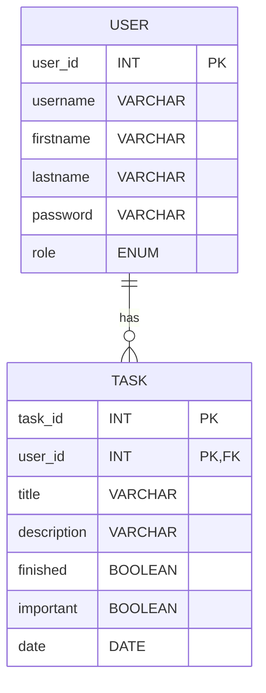

# Blog-Api (Blog Api Rest with authenticate jwt)

1. [Introduction](#introduction)

   - [Description of the Project](#description-of-the-project)
   - [Technologies Utilized](#technologies-utilized)

2. [Architecture](#architecture)

3. [Configuration of the Environment](#configuration-of-the-environment)

   - [Requirements of the System](#requirements-of-the-application)
   - [Instruction for implementation](#instruction-for-implementation)
     - [Backend](#backend)

4. [Modelo de Datos](#modelo-de-datos)

   - [Diagrama de Entidad-Relación (ER)](#diagrama-de-entidad-relación-er)
   - [Descripción de Entidades](#descripción-de-entidades)
     - [Tarea](#tarea)
     - [Usuario (User)](#usuario-user)
     - [Rol (Role)](#rol-role)

5. [API REST](#api-rest)

   - [BlogController](#blog-controller)

     - [Get post by ID](#get-post-by-id)
     - [Get all the posts](#get-all-the-posts)
     - [Create a new post](#create-a-new-post)
     - [Delete selected post](#delete-selected-post)
     - [Update selected post](#update-selected-post)
     - [Create a new comment](#create-a-new-comment)
     - [Get all comments by post](#get-all-comments-by-post)
     - [Get a comment by its ID](#get-a-comment-by-its-id)
     - [Delete comment by its ID](#delete-comment-by-its-id)
     - [Update comment by its id](#update-comment-by-its-id)

   - [AuthController](#authcontroller)

     - [Login](#login)
     - [Register new user](#register-new-user)

6. [Despliegue](#despliegue)
   - [Frontend](#deploy-frontend)
   - [Backend](#deploy-backend)

## Introduction

### Description of the Project

The Blog-api is restful api created with Express js, MongoDb for data base, password encryption with bcrypt js and user authentication with JWT

### Technologies Utilized

- Backend:

  - Express js
  - Javascript
  - Mongoose
  - JWT
  - Express-validator
  - bcryptjs

- Data base:

  - MongoDb

## Architecture

The application follows a monolithic architecture, with the backend implemented as a RESTful API and the frontend as a single page application (SPA).

## Configuration of the environment

### Requirements of the application

- Node.js
- MongoDb

### Instruction for implementation

#### Backend

1.  Clone the repository from [Blog-api repository](https://github.com/LucioFurnari/Blog-Api.git).

2.  Change the mongoose db connect string in app.js file with your connect mongodb link.
3.  Navigate to the main folder with cd \Blog-Api\ 
4.  Run the application using `npm run start` or `npm run devstart` to use with nodemon.

<!-- #### Frontend

1. Clona el repositorio desde [TaskManager Repository](https://github.com/AlejoCzombos/TaskManager.git).
2. Navega hasta la carpeta del frontend con `cd /Front/`
3. Instala las dependencias del frontend con `npm install`.
4. Inicia el servidor de desarrollo del frontend con `npm run dev`. -->

## Modelo de Datos

### Diagrama de Entidad-Relación (ER)



## Descripción de Entidades

### Tarea

- **Descripción:** Representa una tarea en el sistema.
- **Atributos:**
  - `id`: Long (ID de la tarea, autogenerado)
  - `title`: String (Título de la tarea)
  - `description`: String (Descripción de la tarea)
  - `finished`: Boolean (Estado de finalización de la tarea)
  - `important`: Boolean (Indicador de tarea importante)
  - `date`: Date (Fecha de la tarea)
  - `user_id`: Long (ID del usuario al que pertenece la tarea)

### Usuario (User)

- **Descripción:** Representa a un usuario del sistema.
- **Atributos:**
  - `id`: Long (ID del usuario, autogenerado)
  - `username`: String (Nombre de usuario único)
  - `firstname`: String (Nombre del usuario)
  - `lastname`: String (Apellido del usuario)
  - `password`: String (Contraseña del usuario, encriptada)
  - `role`: Role (Rol del usuario, ADMIN o USER)

### Rol (Role)

- **Descripción:** Enumeración de roles posibles para un usuario.
- **Valores:**
  - `ADMIN`: Rol de administrador.
  - `USER`: Rol de usuario normal.

## Security

### Using bcryptjs and Jwt

The application use bcryptjs for encrypted password, and jwt to authentificate users to user ensuring that only authenticated and authorized users can access certain resources and perform certain actions in the application,
with a expiration time.

## API REST

### Blog controller

| Method | Endpoint                | Description                                                 | Enlace Rápido                                                                                                     |
| ------ | ----------------------- | ------------------------------------------------------------ | ----------------------------------------------------------------------------------------------------------------- |
| GET    | `/api/posts/{postId}`   | Get a post by its id.                                 | [Get post by id](#get-post-by-id)                                                                     |
| GET    | `/api/posts`            | Get all posts.   | [Get all the posts](#get-all-the-posts)                         |
| POST   | `/api/posts`   | Create a new post | [Create a new post](#create-a-new-post) |
| DELETE    | `/api/post/{postId}` | Delete post by its id.  | [Delete selected post by id](#delete-selectedpost)   |
| PUT    | `/api/posts/{postId}`  | Update post by its id. | [Update selected post by id](#update-selected-post) |
| GET  | `/api/posts/{postId}/comments`            | Get all comments for post by its id.                        | [Crear Nueva Tarea](#crear-nueva-tarea)                                                                           |
| POST  | `/api/posts/{postId}/comments`            | Create comments in post by its id.               | [Actualizar Tarea Existente](#actualizar-tarea-existente)                                                         |
| GET    | `/api/posts/{postId}/comments/{commentId}`   | Get comments by its id.     | [Cambia el Estado de una tarea por su ID](#cambia-el-estado-de-una-tarea-por-su-id)                               |
| DELETE | `/api/posts/{postId}/comments/{commentId}`   | Delete comment by its id.                                | [Eliminar Tarea por ID](#eliminar-tarea-por-id)                                                                   |
| PUT | `/api/posts/{postId}/comments/{commentId}`   | Update comments by its id.                               | [Eliminar Tarea por ID](#eliminar-tarea-por-id)    
| POST | `/api/users`   | Create a new user.                               | [Eliminar Tarea por ID](#eliminar-tarea-por-id)    
| PUT | `/api/login`   | Log in with the user and create jwt                              | [Eliminar Tarea por ID](#eliminar-tarea-por-id)    

#### Get post by id

- **Endpoint:** `GET /api/posts/{postId}`
- **Descripción:** Get a post by its id.
- **Parámetros:**
  - `postId`: Long (ID of the post)
- **Response:**
  - `200 OK`: Post found successfully.
  - `404 Not Found`: Post not found.

#### Get all the posts

- **Endpoint:** `GET /api/posts`
- **Descripción:** Get all the posts.
- **Parámetros:**
  - `postId`: Long (ID of the post)
- **Respuesta:**
  - `200 OK`: Posts found successfully.
  - `404 Not Found`: Posts not found.

#### Create a new post

- **Endpoint:** `POST /api/posts`
- **Descripción:** Create a new post and save it.
- **Request Body:**

  ```json
  {
    "title": "String",
    "text": "String",
    "timestamp": "YYYY-MM-DD"
  }
  ```
- **Response:**
  - `200 OK`: Post created successfully.
  - `422 Input invalid`: Input of the request are invalid.
  - `500 server error`: Server error.

#### Delete selected post

- **Endpoint:** `DELETE /api/post{postId}`
- **Descripción:** Delete selected post by its id.
- **Parámetros:**
  - `postId`: Long (ID of the post)
- **Response:**
  - `200 OK`: Post deleted successfully.
  - `422 Input invalid`: The id is invalid.
  - `404 Not Found`: Post not found.

#### Update selected post

- **Endpoint:** `PUT /api/posts/{postId}`
- **Descripción:** Update the selected post by its id.
- **Parámetros:**
  - `postId`: Long (ID of the post)
- **Response:**
  - `200 OK`: Post updated successfully.
  - `422 Input invalid`: Input of the request are invalid.
  - `404 Not Found`: Post not found.

#### Create a new comment

- **Endpoint:** `POST /api/posts/{postId}/comments`
- **Descripción:** Create a new comment.
- **Parámetros:**
  - `postId`: Long (ID of the post)
- **Request Body:**

  ```json
  {
    "author": "String",
    "text": "String",
    "timestamp": "YYYY-MM-DD",
    "response_to": "ObjectId",
    "post": "ObjectId"
  }
  ```
- **Response:**
  - `201 Created`: Comment created successfully.
  - `422 Bad input`: Error in the inputs of the user.
  - `500 Server error`: Internal server error.

#### Get all comments by post

- **Endpoint:** `GET /api/{postId}/comments`
- **Description:** Get all coments of the post.
- **Parameters:**
  - `postId`: Long (ID of the post)
- **Response:**
  - `200 OK`: Get all comments successfully.
  - `404 Not Found`: Comments not found.

#### Get a comment by its id

- **Endpoint:** `GET /api/{postId}/comments/{commentId}`
- **Description:** Cambia el estado de una tarea por su ID.
- **Parámetros:**
  - `postId`: Long (ID of the post)
  - `commentId`: Long (ID of the comment)
- **Response:**
  - `200 OK`: Task successfully complete.
  - `400 Bad request`: The id of the comment is not valid
  - `404 Not Found`: Comment not found.

#### Delete comment by its id

- **Endpoint:** `DELETE /api/posts/{postId}/comments/{commentId}`
- **Description:** Delete a comment by its id.
- **Parámetros:**
  - `postId`: Long (ID of the post)
  - `commentId`: Long (ID of the comment)
- **Response:**
  - `200 OK`: Task successfully complete.
  - `400 Bad request`: The comment is not valid.
  - `404 Not Found`: Comment not found.

### Update comment by its id

- **Endpoint:** `PUT /api/posts/{postId}/comments/{commentId}`
- **Description:** Update a comment by its id.
- **Parameters:**
  - `postId`: Long (ID of the post)
  - `commentId`: Long (ID of the comment)
- **Request Body:**

  ```json
  {
    "text": "String",
    "timestamp": "YYYY-MM-DD",
  }
  ```
- **Response:**
  - `200 OK`: Task successfully complete.
  - `400 Bad request`: The comment id is invalid.
  - `422 Invalid input`: Invalid user input.
  -  `404 Not found`: Comment not found.

### AuthController

| Method | Endpoint             | Description                                      | Link                                    |
| ------ | -------------------- | -------------------------------------------------- | --------------------------------------------------- |
| POST   | `/api/login`    | Login the user and return a JWT token.             | [Login](#login)     |
<!-- | POST   | `/api/auth/register` | Registra un nuevo usuario y devuelve un token JWT. | [Registrar Nuevo Usuario](#registrar-nuevo-usuario) | -->

#### Login

- **Endpoint:** `POST /api/login`
- **Description:** Login the user and return a JWT token.
- **Respuesta:**

  - `200 OK`: Login successfully and return JWT token.
  - `422 Invalid input`: Invalid user inputs.
  - `404 Not found`: User not found.
  - `401 Unauthorized`: Password is incorrect.
  - `500 Internal server error`: Internal server error.
  - **Request Body:**

  ```json
  {
    "username": "String",
    "password": "String"
  }
  ```

#### Register new user

- **Endpoint:** `POST /api/register`
- **Descriptionn:** Register a new user and save it in the DB.
- **Parameters:**
  - `request`: RegisterRequest (Request body with new user details)
- **Response:**
  - `200 OK`: Successful registration.
  - `422 Invalid input`: Invalid inputs of the user.
  - `400 Bad Request`: Error en la solicitud o usuario ya existente.
  - `500 Internal server error`: Internal server error.
- **Request Body:**

  ```json
  {
    "username": "String",
    "email": "String",
    "password": "String",
  }
  ```

## Despliegue

Tanto el backend como el frontend e incluso la Base de Datos están desplegados en [Render](https://render.com/). Puedes acceder a ellas mediante los siguientes enlaces.

### Deploy Frontend

[](https://taskmanager-u3h3.onrender.com)

### Deploy Backend

[](https://taskmanager-back.onrender.com)